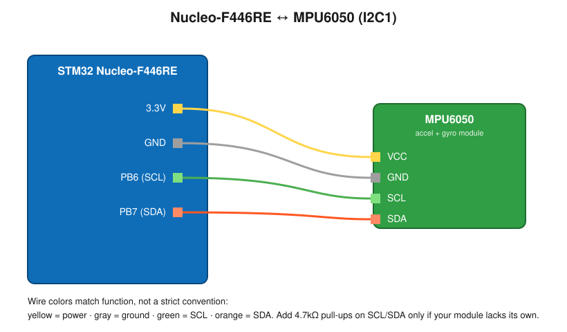

# MPU6050 IMU (Accelerometer + Gyroscope) - STM32 Nucleo-F446RE

Bare-metal (register-level) driver for the MPU6050 IMU, reading raw accelerometer and gyroscope data over I2C and streaming it over UART. 

## How It Works

- Accelerometer and gyroscope registers are read over I2C1 using manual start/address/data/stop sequencing (no HAL I2C driver).
- Gyro Z-axis angular rate is integrated over time (`heading += (gz / 131.0f) * dt`) to produce a running heading estimate.
- Heading is printed with two decimal places, since whole-degree resolution is too coarse to see the value changing over short observation windows.
- All values (ax, ay, az, gz, heading) are printed continuously over UART2 for live monitoring.

## Pin Connections

| MPU6050 Pin | Nucleo Pin | Function |
|-------------|------------|----------|
| VCC         | 3.3V       | Power |
| GND         | GND        | Ground |
| SCL         | PB6        | I2C1 clock |
| SDA         | PB7        | I2C1 data |

UART2 (for debug output over a serial terminal):

| Nucleo Pin | Function |
|------------|----------|
| PA2        | USART2 TX |
| PA3        | USART2 RX |

Connect a serial terminal (screen, minicom, PuTTY) to the Nucleo's ST-Link virtual COM port at **115200 baud** to view output.

## Key Registers Used

| Register | Address | Purpose |
|----------|---------|---------|
| WHO_AM_I | 0x75 | Identity check - should read `0x68` (104 decimal) if I2C communication is working |
| PWR_MGMT_1 | 0x6B | Power management - written with `0x00` on init to wake the sensor from its default sleep state |
| ACCEL_XOUT_H | 0x3B | Start of a 6-byte accelerometer burst read (X, Y, Z, high byte first) |
| GYRO_XOUT_H | 0x43 | Start of a 6-byte gyroscope burst read (X, Y, Z, high byte first) |

## Units and Scaling

- **Accelerometer**: default ±2g range, sensitivity 16384 LSB/g. A stationary, level board should read close to ±16384 on whichever axis is aligned with gravity, and near 0 on the other two.
- **Gyroscope**: default ±250°/s range, sensitivity 131 LSB/(°/s). Convert raw to degrees/second via `raw / 131.0f`.
- **Heading**: obtained by integrating gyro Z-axis rate over time. This is a relative estimate only - it drifts over time (inherent to all MEMS gyros) and is not corrected against an absolute reference (no magnetometer on the MPU6050). Acceptable for short-duration use; not reliable for long-running absolute heading.

## Clock Configuration

This project runs on the default reset clock - **HSI, 16MHz, no PLL** (no `SystemClock_Config()` call). All I2C and UART timing values are calculated for a 16MHz APB1 clock:

- I2C1: `CR2 = 16`, `CCR = 80` (100kHz standard mode), `TRISE = 17`
- UART2: `BRR = 0x8B` (115200 baud) - see note below

**Note on the UART BRR value**: the datasheet-standard mantissa/fraction calculation for 115200 baud at 16MHz gives `BRR = 0x8AE`, but this did not produce readable output on this hardware. `BRR = 0x8B` (139 decimal) was found empirically to work reliably instead. The discrepancy is unresolved - treat `0x8B` as the known-working value for this specific setup rather than a datasheet-derived one.

## Known-Good Behavior

- `WHO_AM_I` read returns `104` (`0x68`) - confirms I2C wiring and timing are correct.
- Flat and level, `az` reads close to full-scale (~16384) with `ax`/`ay` near 0; tilting the board correctly redistributes the reading across axes, confirming the accelerometer tracks orientation as expected. The vector magnitude (√(ax²+ay²+az²)) should stay close to ~16384 regardless of orientation.
- Stationary, `gz` hovers near 0 with small sensor noise; deliberate rotation produces a proportional, visible change in the accumulated `heading` value.

## Code Structure

- `I2C1_Init()` - configures PB6/PB7 for I2C1 (open-drain, alternate function, internal pull-up as backup).
- `I2C1_Start()`, `I2C1_Stop()`, `I2C1_WriteAddr()`, `I2C1_WriteData()`, `I2C1_ReadDataAck()`, `I2C1_ReadDataNack()` - low-level I2C byte-level primitives.
- `MPU6050_Init()` - wakes the sensor by clearing the sleep bit in `PWR_MGMT_1`.
- `MPU6050_WriteReg()` / `MPU6050_ReadReg()` - single-register write/read helpers.
- `MPU6050_ReadAccel()` / `MPU6050_ReadGyro()` - 6-byte burst reads for all three axes at once.
- `UART2_Init()`, `UART2_SendChar()`, `UART2_SendString()`, `UART2_SendInt()` - bare-metal UART2 output, no `printf`.

## Status

- Done: I2C communication confirmed (WHO_AM_I correct).
- Done: Accelerometer readings validated across multiple orientations.
- Done: Gyroscope readings and heading integration validated (with decimal-precision print).
- Not yet done: drift correction (would require combining with the accelerometer via a complementary/Kalman filter, or an absolute reference such as a magnetometer).

